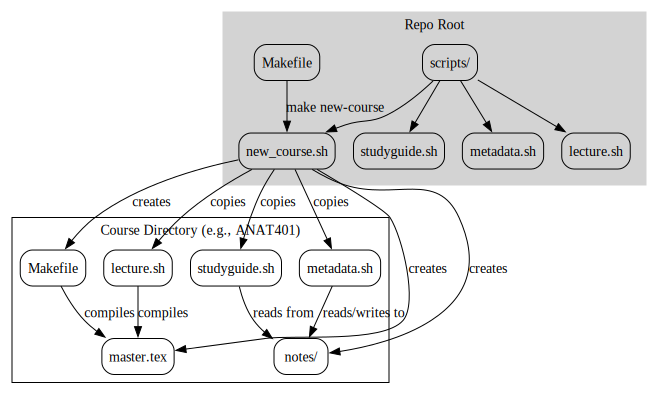

# LaTeX Notes System

A comprehensive suite of bash scripts and LaTeX templates for managing course notes, lectures, and study materials.

## Quick Start

1.  **Create a new course:**
    ```bash
    make new-course YEAR=2025-2026 COURSE_CODE=ANAT401 COURSE_NAME="Human Anatomy I"
    ```

2.  **Navigate to the course directory:**
    ```bash
    cd 2025-2026/ANAT401
    ```

3.  **Create your first lecture:**
    ```bash
    ./lecture.sh new 01 "Introduction to Anatomy"
    ```

4.  **Compile your notes:**
    ```bash
    make
    ```

## Workflow

The main workflow is:

1.  Create a course using `make new-course`.
2.  `cd` into the course directory.
3.  Use the scripts (`lecture.sh`, `studyguide.sh`, `metadata.sh`) within the course directory to manage your notes.

## Directory Structure

```
~/School/
├── Makefile
├── scripts/
│   ├── new_course.sh
│   ├── lecture.sh
│   ├── studyguide.sh
│   └── metadata.sh
└── 2025-2026/
    └── ANAT401/
        ├── master.tex
        ├── preamble.tex
        ├── Makefile
        ├── README.md
        ├── lecture.sh
        ├── studyguide.sh
        ├── metadata.sh
        ├── notes/
        ├── figures/
        ├── exams/
        ├── studyGuides/
        └── UltiSnips/
```

## Script Reference

### `scripts/new_course.sh`

Creates a new course directory with all the necessary files and subdirectories.

**Usage:**
```bash
make new-course YEAR=<year> COURSE_CODE=<code> COURSE_NAME="<name>"
```

### `scripts/lecture.sh`

Manages lectures within a course. You must be inside a course directory to use it.

**Commands:**
*   `./lecture.sh new <num> <title>`: Creates a new lecture.
*   `./lecture.sh list`: Lists all lectures.
*   `./lecture.sh edit <num>`: Edits a lecture file.
*   `./lecture.sh compile`: Compiles the main `master.tex` file.
*   `./lecture.sh watch`: Watches for file changes and auto-compiles.

### `scripts/studyguide.sh`

Generates study guides, flashcards, and question lists from your lecture notes.

**Commands:**
*   `./studyguide.sh exam <num> [range]`: Creates a study guide for an exam.
*   `./studyguide.sh topic <name> [range]`: Creates a study guide for a specific topic.
*   `./studyguide.sh flashcards [range]`: Extracts content for flashcards.
*   `./studyguide.sh questions [range]`: Extracts all review questions.

### `scripts/metadata.sh`

Manages metadata for your lectures. This script allows you to track information about each lecture, such as dates, topics, and associated assignments.

**Features:**
*   **Track Lecture Details:** Set and view lecture dates, times, textbook chapters, and reading assignments.
*   **Organize with Tags:** Assign tags to lectures to easily find related topics (e.g., `cell-biology`, `exam1-material`).
*   **Manage Assignments:** Keep track of homework and quizzes associated with each lecture, including due dates.
*   **Exam Planning:** Mark which lectures are covered by which exam.
*   **Sync with Calendar:** (Requires `calendar.sh`) Sync lecture dates and times to a calendar.

**Usage:**
```bash
./metadata.sh <command> [options]
```

**Commands:**
*   `init`: Initializes the metadata system in a course directory.
*   `set <lec_num> [options]`: Sets metadata for a specific lecture.
*   `get <lec_num>`: Displays the metadata for a lecture.
*   `list`: Lists all lectures with their metadata.
*   `chapters`: Shows a mapping of textbook chapters to lectures.
*   `due`: Shows upcoming homework and quiz due dates.
*   `exam <num>`: Shows all lectures covered by a specific exam.
*   `tags <tag>`: Finds all lectures with a specific tag.

**Metadata Options for `set` command:**
*   `--date <YYYY-MM-DD>`
*   `--time <HH:MM>`
*   `--chapter <num>`
*   `--reading <pages>`
*   `--tags <tag1,tag2>`
*   `--hw <name> --hw-due <date>`
*   `--quiz <date>`
*   `--exam <num>`
*   `--difficulty <1-5>`
*   `--notes <text>`

**Example:**
```bash
# Set metadata for lecture 5
./metadata.sh set 05 --date 2025-09-15 --tags "cell,signaling" --exam 1

# Find all lectures for exam 1
./metadata.sh exam 1
```

## Flowchart

